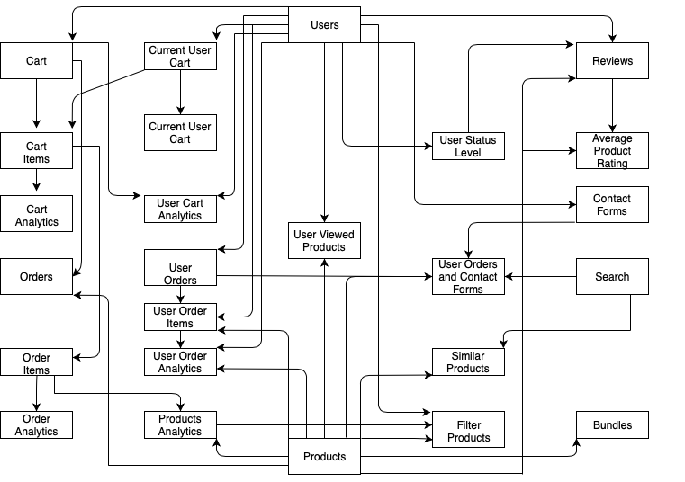

# Clef Co - Virtual Store

* Clef Co is a mock E-commerce application based on musical instruments, audio equipment and recording software.

## Project Walk-through

### Page Details
* Home
    * The user is greated with the company name over a video background
    * If they are first viewing the page, they are presented with a cookie warning
    * As they scroll down, they are presented with two random products followed by the top six selling products
    * Following the products, there are reviews from users
        * Only reviews that are four stars or above are displayed
    * Finally, if they are logged in, the last three viewed products are displayed
* Products
    * The user is shown the most recently add product
        * Product name, description and image are displayed
    * Next, they encounter the product bundles
        * Bundles are predetemined products based off of genres
        * When they click the "Learn more" button, a modal with the all the products included appears.
            * If they are logged in, they have the ability to add all of the items to their cart
            * Otherwise, they are prompted to login
        * Each bundle is designed to look an iPod
            * Each bundle has a collection of images that it cycles through
    * From there, the user is presented with a random product
        * Product name, description and image are displayed
    * Following the product, they are presented with options to contact support, view tutorials and view their cart
        * Contact support and view tutorials redirect to the appropriate page
        * If the user is not logged in, the notification pops up telling them to login to view their cart
    * Finally, if they are logged in, the last three viewed products are displayed
* Shop
    * At first, the user is shown all of the products
        * Each product has the image, name, part of the description and button to add it to the cart
            * If the user is not logged in, the notification pops up telling them to login to add to their cart
            * If the user clicks on the product, they are redirected to the product page for that product
    * There is a menu on the side that allows the user to filter the products
        * Four main categories
            * Featured - when either option is selected, all other categories are deselected
                * Most popular displays products in order of quantity sold in descending order
                * Bestsellers displays products in order of revenue in descending order
            * Instruments - user can select and combination of different instruments to display on page
            * Bundles - when any option is selected, all other categories are deselected
                * All products displayed are predetermined based off of genres
            * Type - use can select either option to display on page
                * Allows user to filter by hardware or software
* Tutorials
    * The user is presented with a list of videos embedded on the page
* Contact
    * If the user is logged in, they are given a contact form where they can detail the issue they are facing and select the product they are asking about
    * If they aren't logged in, they are presented with the option to either login or create an account
    * Scrolling down, they are presented with social media links and images related to customer service
* Search
    * If the user searched through the navbar, they are presented with the results of their search
    * If they are logged in, the results are populated with products, contact forms they have submitted and orders that relate to their search
    * If not logged in, the results are populated with products related to their search
* Login/Create Account
    * Both pages validate the user input for a valid email and password length that is greater than 8
    * When creating an account, if the email matches one already in the database, the user is unable to create an account
    * On successful login, the user profile information is saved to session storage and the user is redirected to the profile page
* Profile
    * Populated with information about the user
        * User address and contact information is displayed
            * They have the option to update their information
        * Next, the news feed is displayed
            * Populated with information about their last order, contact form, last rating and a message from the company for that month
                * If rating is below three stars, they are asked to submit a contact form
        * User status is determined based on the length of time since they created the account
            * The images displayed are based off the four statuses
    * Scrolling down, the user is presented with the last three viewed products are displayed
    * After that, all of the orders for the user are displayed, most recent first
    * At the bottom of the page, they are given the option to delete their account
        * If they choose to not delete the account, the page is scrolled to the top
        * If they do delete their account, their account is deleted and they are redirected to the create account page
* Cart
    * Every time the user adds an item to the cart, it is saved to the database
    * Only one cart can be available for a user at a time, once an order is completed, it is converted into an order
    * The cart is pulled from the API on every page using Redux
    * If an item is already in the cart, a notification appears letting the user know
    * Checking out
        * Populated with all items the user has added to the cart
            * User can delete an item
            * User can update the quantity of all products that are hardware
                * If the quantity is updated to less than zero, it is removed from the cart
        * Based off of the user's state, tax is calculated and added to the total
        * If the pre-tax amount is greater than $99, shipping is free
        * On the next page, all of the user's address and contact information is pre-populated
            * The user has the ability to change the information accordingly
            * If they have not included an address, they are unable to proceed to the next page
        * On the next page, they are prompted for their credit card information
            * Card information is not stored anywhere, but it is checked for a valid credit card number
            * The name input cannot be empty
            * The date input must be after the current date
            * The security code must be at least three numbers
            * If any of the information is invalid or empty, they will not be able to proceed to the next page
        * On the final page, they are presented with all of order information, address/contact informationa and credit card information
            * Once they click the "proceed" button, the order is saved and they are presented with options to go to their profile and to contact support
            * A notification confirming their order is displayed
        * At any point before completing the purchase, they can go back to a previous step and their information will be saved
* Product Page
    * Each product is dynamically created on the App component through mapping through the products
    * Page is populated with product information, average rating on the product and ability for the user to add to their cart
        * If the product is hardware, they can change the quantity
    * Next, the user is presented with the option to submit a review
        * They can only submit a review if they have purchased the product
    * Scrolling down, all reviews for the product are shown
    * Finally, if they are logged in, the last three viewed products are displayed 

### Back-end Process
* Because every schema on this application relates to at least one other table, I used SQL.  In order to avoid any future security risks from using an ORM tool like Sequelize, I wrote out my SQL queries.  Also, because I was writing complex queries, I was able to test them out in MySQL Workbench without having my server running the entire time.
    * Table relationships
        

## User Stories

* "I want to browse a site and find all kinds of instruments, music gear and tech."
* "I want to order products and browse my previous orders."
* "I want to easily access tutorials and contact support for products I previously ordered."

## Client Stories

* "My company needs to sell our products online."
* "My company wants to keep track of data on our users."
* "My company wants to keep track of data about our products."

## Future Improvements

* Save information on users that have not signed in and add to database if they create an account.
* Add a chat function for customer support.
* Create a page for viewing all non-private information in the API.
* Create ability for the user to create their own product to sell in the shop.
* Add search suggestions drop down on the navbar.
* Add a forgot password option on the login screen after the user attempts to login three times.

## Major Issues Encountered
* Responsiveness
* API routing and SQL queries
* Converting React class components to functions in order to use hooks and Redux
* Consistent styling across all pages
* Loading time
* Implementing Redux

## Technologies Used

* React.js/React-router
* Node.js
* SQL
* Express.js
* Javascript/ES6
* HTML/CSS
* Session Storage
* [Material-UI](https://material-ui.com/)
* [Bootstrap](https://getbootstrap.com/)
* [Moment](https://momentjs.com/)
* [React-textfit](https://www.npmjs.com/package/react-textfit)
* [React-reveal](https://www.react-reveal.com/)
* [React-toastify](https://www.npmjs.com/package/react-toastify)
* [Glamor CSS](https://www.npmjs.com/package/glamor)
* [React-player](https://www.npmjs.com/package/react-player)
* [React-star-ratings](https://www.npmjs.com/package/react-star-ratings)

## Author
* Clint Brodar

### Version
* 1.0.0